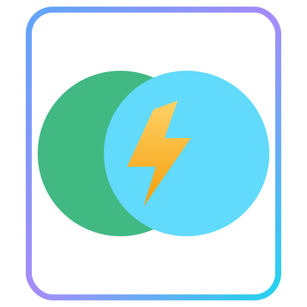

# docs-islands — Cross‑framework Islands Architecture for Documentation Sites

[中文文档](README.zh-CN.md)

**Conclusion-first**: docs-islands brings an islands architecture to documentation sites with selective and lazy hydration, designed to be UI‑framework‑agnostic and pluggable across build tools. Today it offers zero‑friction integration for VitePress via `@docs-islands/vitepress`; the same model scales to other stacks (e.g. future `@docs-islands/docusaurus`, `@docs-islands/nextra`, and library toolchains like `@docs-islands/rslib`).

## Why

- **Static‑first** content delivery with precise, per‑component hydration when interactivity is needed.
- **No lock‑in**: adapters keep the core agnostic to site frameworks and UI frameworks (React today; more to come).
- **Consistent DX**: identical rendering semantics between dev and prod where feasible; clear trade‑offs documented when not.

## Key capabilities

- **Selective & lazy hydration** at the component level: `client:only`, `client:load`, `client:visible`, `ssr:only` (default).
- **SPA synchronous render (spa:sr)** to eliminate flicker during SPA navigations by merging critical pre‑rendered HTML into the page client script and blocking critical styles until ready.
- **Cross‑framework UI**: React supported now; architecture allows Solid/Svelte/Preact/Angular adapters.
- **Pluggable build integration** inspired by unplugin: one core, many adapters.

## Monorepo layout (high level)

- `packages/vitepress/`: VitePress integration (plugins + client runtime)
- `packages/core/`: shared primitives for orchestration and runtime
- `packages/utils/`, `packages/eslint-config/`: internal utilities and config

For detailed concepts and VitePress usage, see:

- Concept: `packages/vitepress/docs/en/concept.md`
- Quick start: `packages/vitepress/docs/en/quick-start.md`

---

## Quick Start (VitePress + React)

See full guide in `packages/vitepress/docs/en/quick-start.md`. Minimal steps:

```ts
// .vitepress/config.ts
import { defineConfig } from 'vitepress';
import vitepressReactRenderingStrategies from '@docs-islands/vitepress/react';

const vitePressConfig = defineConfig({});
vitepressReactRenderingStrategies(vitePressConfig);
export default vitePressConfig;
```

```ts
// .vitepress/theme/index.ts
import DefaultTheme from 'vitepress/theme';
import reactClientIntegration from '@docs-islands/vitepress/react/client';
import type { Theme } from 'vitepress';

const theme: Theme = {
  extends: DefaultTheme,
  async enhanceApp() {
    await reactClientIntegration();
  }
};

export default theme;
```

```md
<script lang="react">
  import Landing from '../components/Landing';
  // React 18
</script>

<Landing ssr:only spa:sr title="Hello" />
```

### Directives quick reference

| Directive | Pre‑render HTML | Client hydration | Load timing | Typical usage | `spa:sr` default |
| --- | --- | --- | --- | --- | --- |
| `ssr:only` | Yes | No | N/A | Static/SEO‑critical sections | Enabled |
| `client:load` | Yes | Immediate | Preload module, hydrate on load | Above‑the‑fold interactive | Disabled |
| `client:visible` | Yes | On visible | Preload; hydrate on intersection | Offscreen interactions | Disabled |
| `client:only` | No | N/A | Client‑only | Host‑dependent/lightweight | Disabled |

SPA synchronous rendering (`spa:sync-render` / `spa:sr`) drastically reduces CLS during navigations by merging the pre‑rendered output of marked components into the page client script and ensuring all required CSS modules are loaded before render. Use it selectively for critical components due to the additional navigation‑time script cost.

References: [VitePress](https://vitepress.dev/), [Astro Islands](https://docs.astro.build/en/concepts/islands/), [CLS](https://web.dev/articles/cls), [IntersectionObserver](https://developer.mozilla.org/en-US/docs/Web/API/Intersection_Observer_API).

---

## Adapter model (build/toolchain agnostic)

The project aims to expose a stable adapter interface so any documentation/site system can opt‑in with minimal glue. A simplified draft type (subject to change):

```ts
export interface FrameworkAdapterContext {
  rootDir: string;
  command: 'serve' | 'build';
  ssr: boolean;
}

export interface FrameworkAdapter {
  /** Unique id, e.g. 'vitepress' */
  id: string;
  /** Human readable name */
  name: string;

  /**
   * Discover and transform framework component tags inside markdown/templates
   * into islands containers with proper directives metadata.
   */
  transformContainers(
    code: string,
    id: string,
    ctx: FrameworkAdapterContext
  ): Promise<string> | string;

  /** Inject page/client runtimes needed by selective hydration. */
  injectClientRuntime(): unknown;

  /** Wire up dev HMR and production SSG/SSR hooks for the host system. */
  setupDevAndBuildPipelines(): unknown;
}
```

Planned adapters include `@docs-islands/docusaurus`, `@docs-islands/nextra`, and build‑tool bridges for Rspack/Rsbuild ecosystems (e.g. `@docs-islands/rslib`).

---

## Performance and trade‑offs

- `spa:sr` improves navigation smoothness at the cost of larger page client chunks during navigations. It does not affect the initial `.lean.js` used by VitePress for first‑load hydration.
- `client:visible` preloads scripts to avoid network jank when an element enters the viewport; it is intentionally not a pure lazy‑load.
- In dev, VitePress uses dynamic evaluation for SPA modules. Production timing differs, so the system simulates production behavior where possible; see details in `packages/vitepress/docs/en/concept.md`.

---

## Logos

The repository includes a small logo set under `assets/logo/`. All variants use a neutral core and provide a host‑badge slot so that official framework marks can be placed by downstream (when allowed by their brand rules). We do not embed third‑party logos in repo SVGs.

- `islands-app.svg`: main project logo (also used as docs favicon base)
- `islands-vitepress.svg`: variant with rounded‑rect badge slot (place Vite/VitePress mark externally)
- `islands-badge-docusaurus.svg`, `islands-badge-nextra.svg`: circular or dark rounded‑rect badge slots

Usage in markdown:

```md

```

Design principle: neutral “islands” core (intersecting circles + hydration star). Host‑badge slots respect brand guidelines: place official marks externally at runtime or in your build pipeline. See `assets/logo/README.md`.

---

## Roadmap (high level)

- Solid/Svelte/Preact/Angular component renderers
- Generalized adapter API with examples for other site systems
- Rspack/Rsbuild toolchain bridges (`rslib` ecosystem)
- Advanced hydration policies and build‑time analysis

---

## Contributing

Requirements: Node.js ≥ 20.19, pnpm, TypeScript strict mode. Please run lint and tests before sending PRs. Read concept and quick‑start docs first.

---

## License

MIT
